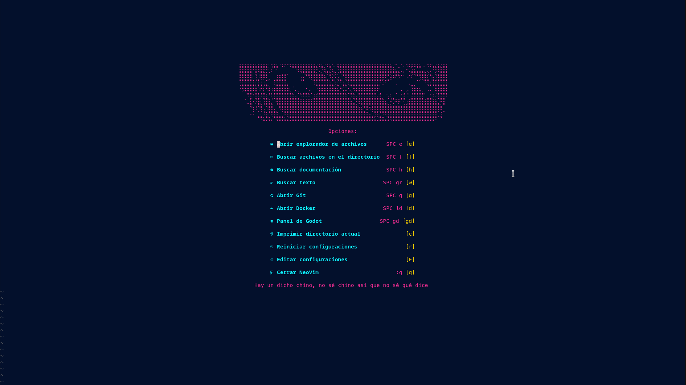
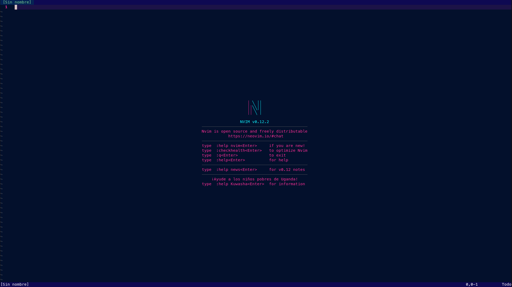
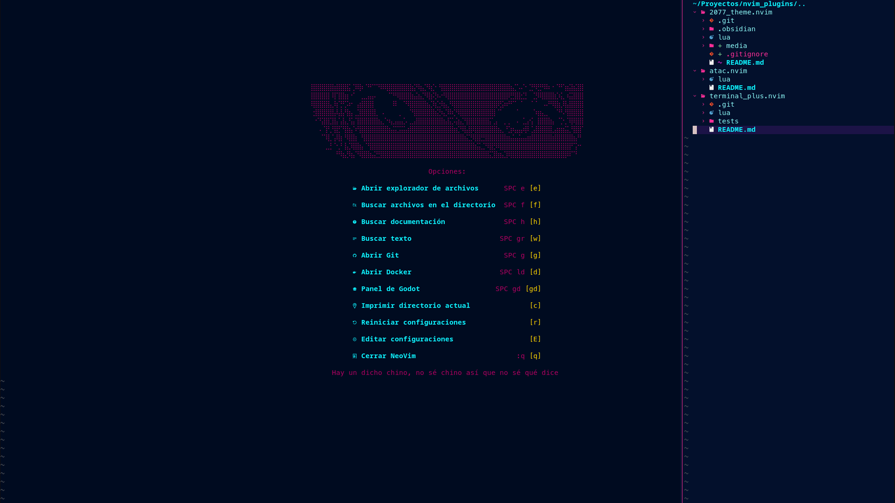
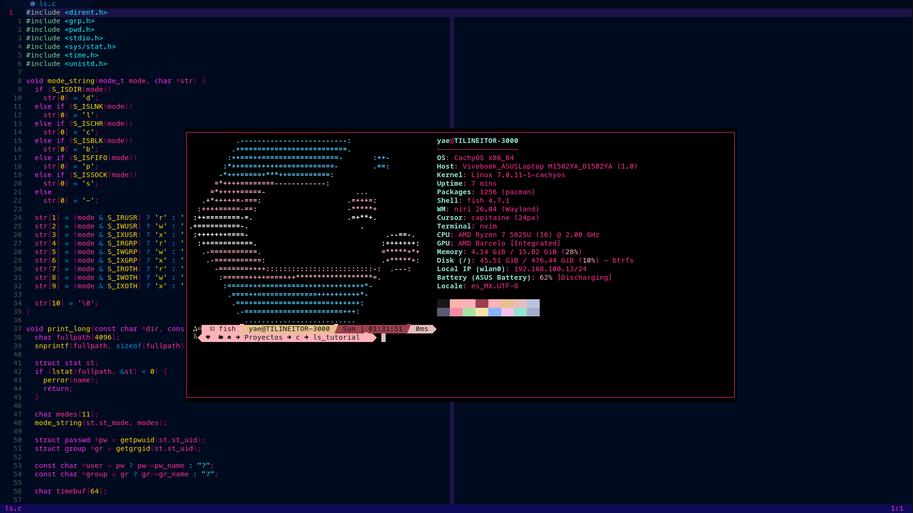
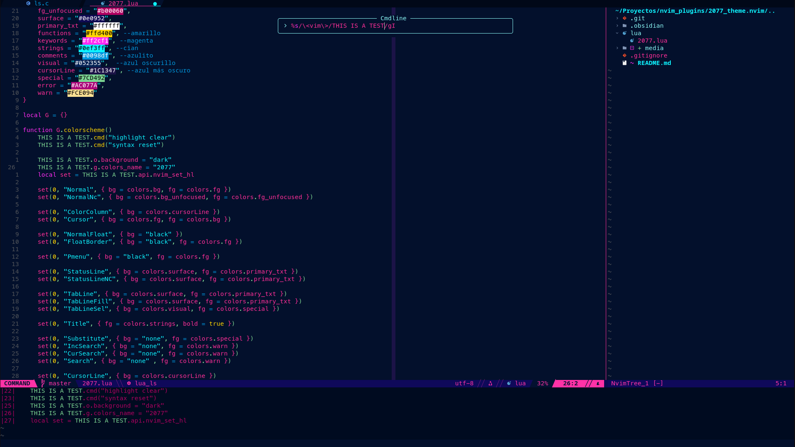
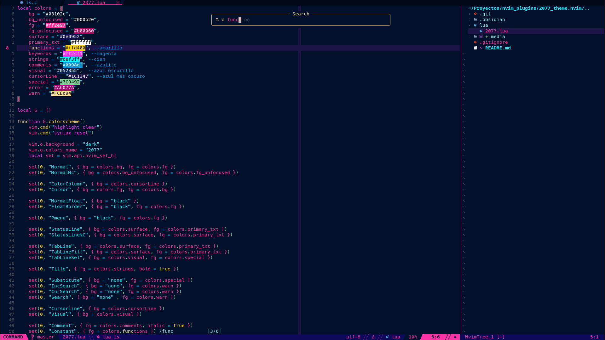
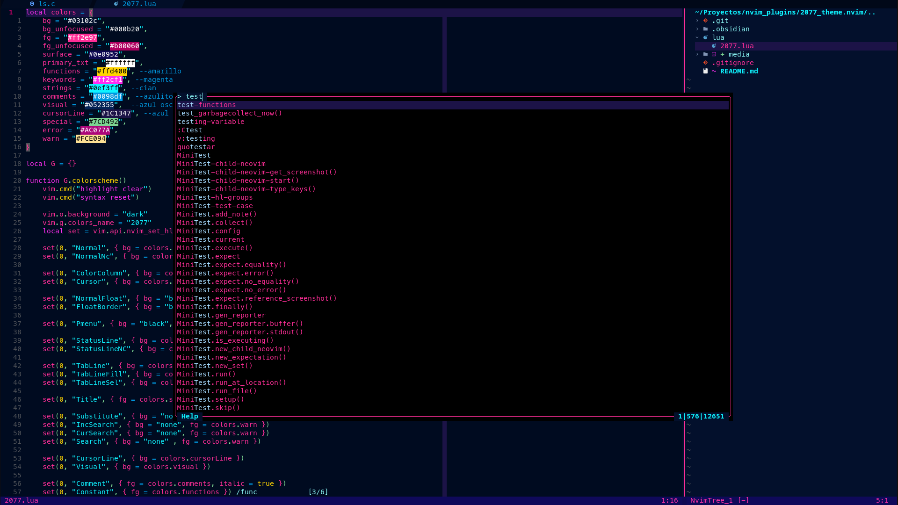

# Cyberpunk 2077 theme for NeoVim
Inspired by the 2077 themes for [Zed](https://github.com/notKvS/2077-zed) and [VSCode](https://github.com/endormi/vscode-2077-theme). Made following the steps in [this video](https://www.youtube.com/watch?v=LUtgHPOeefA).



# Installation
## With vim.pack (NeoVim >= 0.12):

```lua
vim.pack.add( { "https://github.com/YBJ-UP/2077_theme.nvim" } )
```

## Usage:

```lua
require("2077").colorscheme()
```

# Screenshots:











